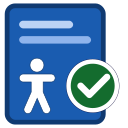
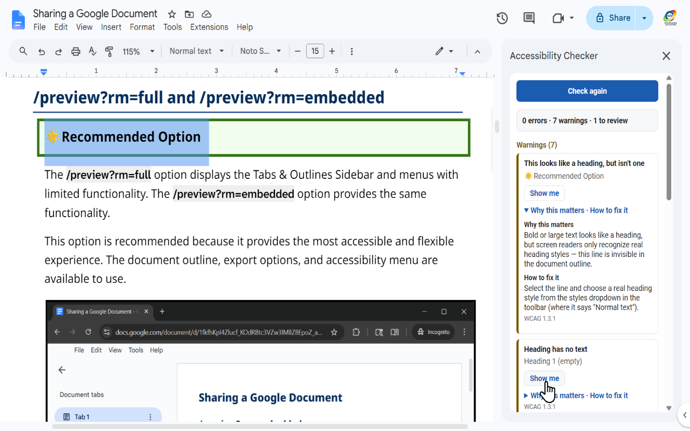

<meta name="google-site-verification" content="GTcIUryQG_ChxbHt9jOV61fk0j9yaArzTdVL5ygF8R0" />

# Docs Accessibility Checker

A **free, open-source add-on for Google Docs** that helps anyone — no accessibility
training required — find and fix common accessibility problems in their documents,
explained in plain language. Created by the Instructional Media team at
[Rio Salado College](https://learnatrio.com/rio-home?utm_source=OpenSource&utm_medium=a11y_app&utm_campaign=Instructional%20Technology).

## What the add-on does

Open a Google Doc, choose **Extensions ▸ Docs Accessibility Checker ▸ Check document**,
and press **Check my document**. The add-on reads the open document and shows a sidebar
listing accessibility problems it found. Every finding explains _why it matters_ to a
real reader and _how to fix it_, with the exact Docs menu path — and includes a
**Show me** button that jumps to the problem in your document. For image alt text and
link text, a **Fix** button applies your correction in one click.

### The checks

| Check                                                                 | WCAG (2.2 AA)    | One-click fix?       |
| --------------------------------------------------------------------- | ---------------- | -------------------- |
| Images missing (or unhelpful) alt text                                | 1.1.1            | ✅ yes               |
| Heading structure — skipped levels, "fake" bold headings, no headings | 1.3.1 / 2.4.6    | guidance             |
| Vague link text ("click here") and raw URLs                           | 2.4.4            | ✅ yes               |
| Low text color contrast (with the measured ratio)                     | 1.4.3            | guidance             |
| Untitled document                                                     | 2.4.2            | guidance             |
| Tables — header rows, layout tables                                   | 1.3.1            | guided manual review |
| Drawings / charts alt text                                            | 1.1.1            | guided manual review |
| Text smaller than 10 pt (with the measured size)                      | 1.4.4 (advisory) | guidance             |

The add-on is a helper and teaching tool, not a certification: passing all checks does
not guarantee full WCAG conformance.

## Your data: what the add-on can access, and why

The add-on requests exactly two permissions, and here is what each is used for:

- **View and manage the document the add-on is installed in**
  (`https://www.googleapis.com/auth/documents.currentonly`) — used to read the
  currently open document's content when you press "Check my document," and to apply
  the specific fixes you request (such as setting an image's alt text) to that document
  only. It cannot access any other file in your Google Drive.
- **Display sidebars and other UI inside Google applications**
  (`https://www.googleapis.com/auth/script.container.ui`) — used solely to show the
  add-on's results sidebar inside Google Docs.

Beyond that, the add-on collects **nothing**: it runs entirely inside Google's Apps
Script environment, makes **no external network requests**, has **no server**, and
**stores no data**. Document content is processed in memory during a scan and never
saved, logged, or transmitted. There are no analytics, no ads, and no tracking.

Full details: [Privacy Policy](privacy-policy.html) · [Terms of Service](terms.html)

## Open source

The complete source code is publicly available, so anyone can verify how the add-on
works: [github.com/rsc-media/gdoc-a11y](https://github.com/rsc-media/gdoc-a11y)
(MIT license). Bug reports and suggestions are welcome on
[GitHub Issues](https://github.com/rsc-media/gdoc-a11y/issues).

## Support

- Open an issue: [GitHub Issues](https://github.com/rsc-media/gdoc-a11y/issues)
- Email: [rio.media@riosalado.edu](mailto:rio.media@riosalado.edu)

---

Courtesy of [Rio Salado College](https://learnatrio.com/rio-home?utm_source=OpenSource&utm_medium=a11y_app&utm_campaign=Instructional%20Technology) ·
[Privacy Policy](privacy-policy.html) · [Terms of Service](terms.html) ·
[View project on GitHub](https://github.com/rsc-media/gdoc-a11y)
